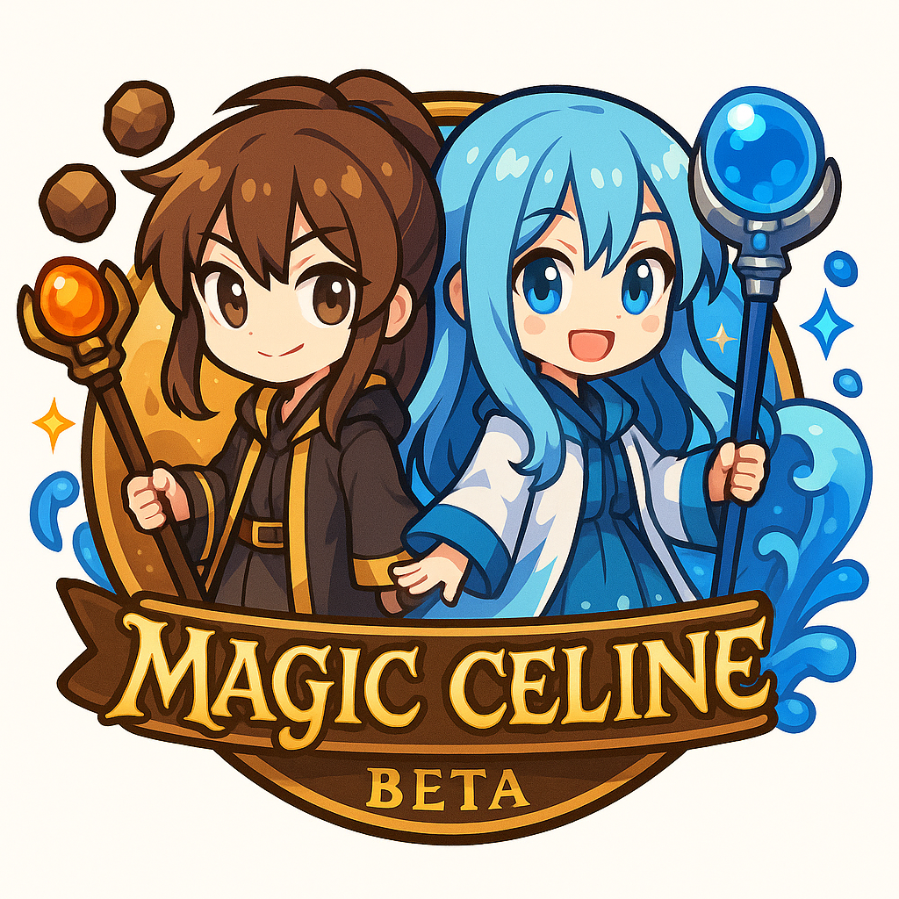

<div align="center">

# ☁️ 이준빈 | Game Developer

### Creating Games in the World of Cernia

<br>

Unity와 C#을 중심으로 게임과 소프트웨어를 개발하고 있습니다.  
게임 시스템, 데스크톱 애플리케이션, AI와 머신러닝까지  
직접 설계하고 구현하는 것을 좋아합니다.
<br>

### Main Tech Stack


<br>


</div>

---

# About Me

안녕하세요! 게임과 소프트웨어를 만드는 개발자 **이준빈**입니다.

게임을 단순히 플레이 가능한 형태로 만드는 것뿐만 아니라,  
그 안에서 동작하는 **전투 시스템, 캐릭터 구조, 데이터 관리, AI, UI, 개발 도구와 서버 시스템**까지  
직접 설계하고 구현하는 것을 좋아합니다.

현재는 **Magic Celine**과 **Flying Cernia**를 중심으로,  
**세르니아**라는 세계를 배경으로 한 게임과 다양한 소프트웨어 프로젝트를 개발하고 있습니다.

---

# Main Projects

<table>
<tr>

<td width="50%" align="center" valign="top">

<h2>✨ Magic Celine</h2>



<h3>2D Action RPG</h3>

<b>Unity · C#</b>

직접 개발하고 있는  
2D 액션 RPG 프로젝트입니다.

<br>

캐릭터 성장, 전투, 스킬, 몬스터 AI,<br>
아이템, 퀘스트, 보스전과 월드 시스템을<br>
직접 설계하고 구현하고 있습니다.

</td>

<td width="50%" align="center" valign="top">

<h2>☁️ Flying Cernia</h2>


<h3>2D Flight Action Game</h3>

<b>Unity · C#</b>

Magic Celine의 세계인  
세르니아를 배경으로 제작하는  
2D 비행 액션 게임입니다.

<br>

비행 조작, 장애물, 점수 시스템,<br>
랭크, 업적과 온라인 랭킹 시스템을<br>
개발하고 있습니다.

</td>

</tr>
</table>

---

# ✨ Celine

```csharp
public class Celine
{
    public string Name => "Celine";

    public string[] Interests =>
    {
        "Game Development",
        "Software Engineering",
        "Artificial Intelligence",
        "Game Engine Architecture",
        "Tools Development"
    };

    public string MainLanguage => "C#";

    public void Create()
    {
        Console.WriteLine("Creating the world of Cernia...");
    }
}
